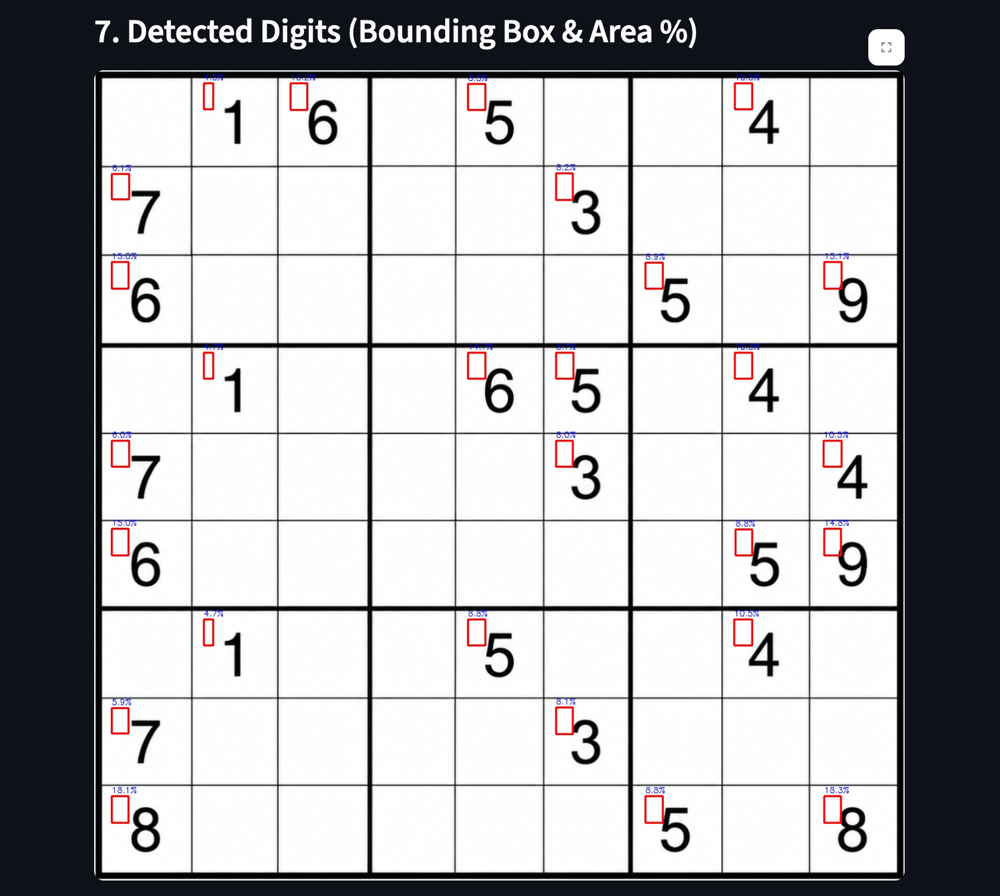
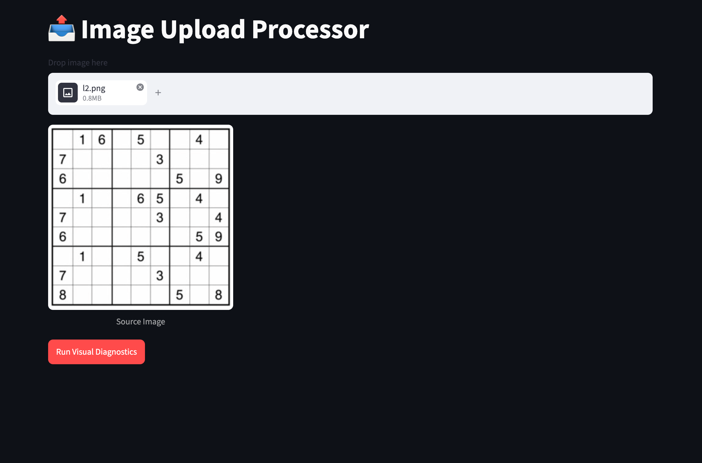
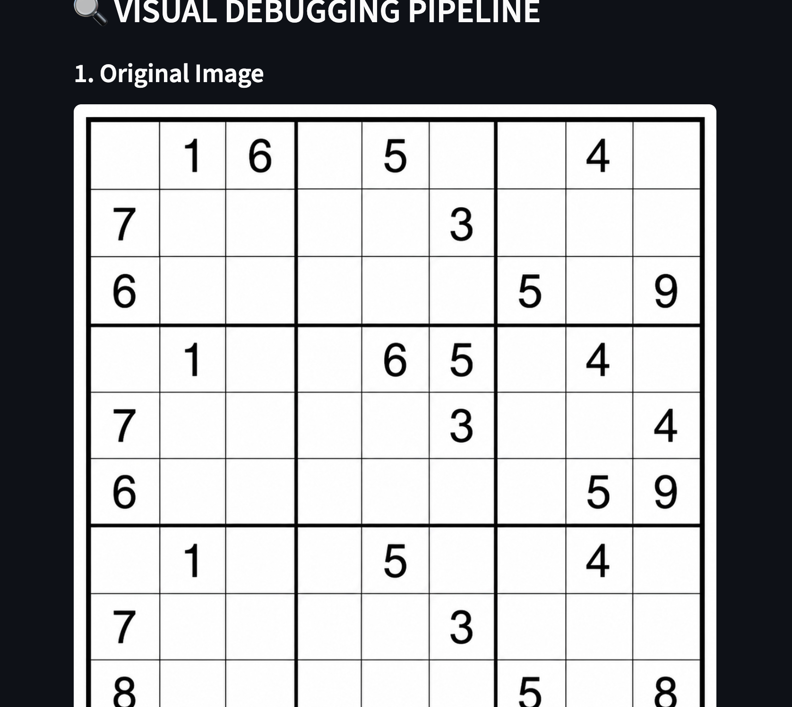
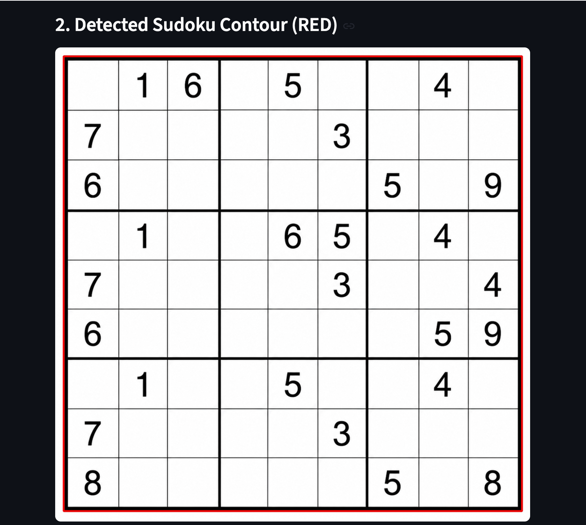
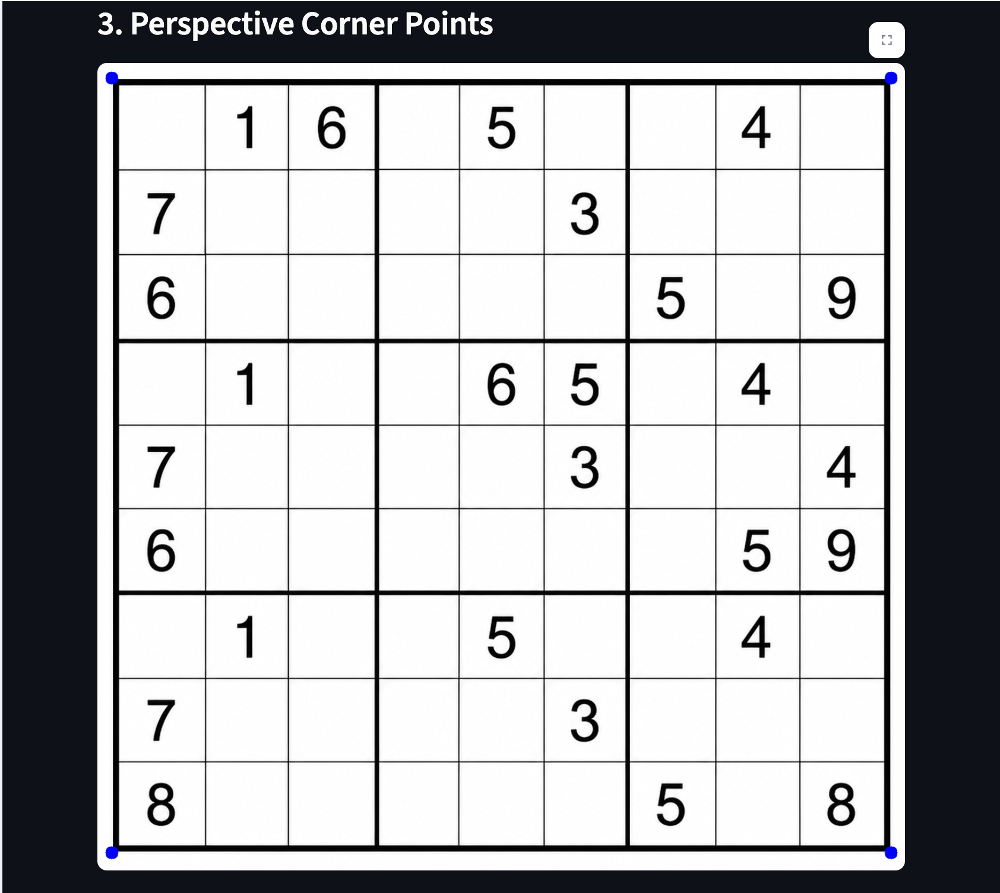
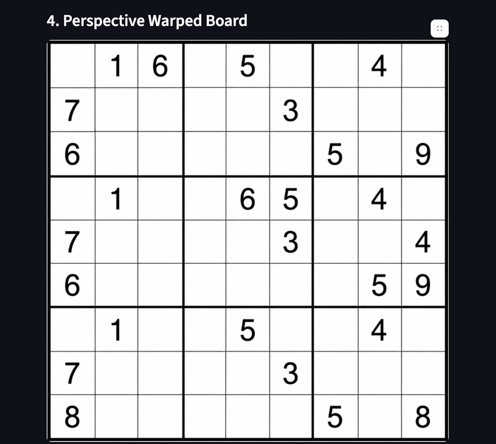
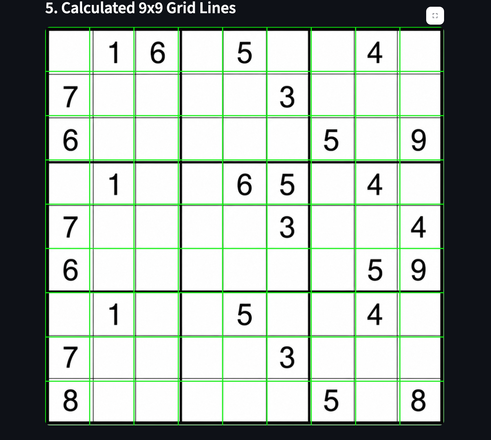
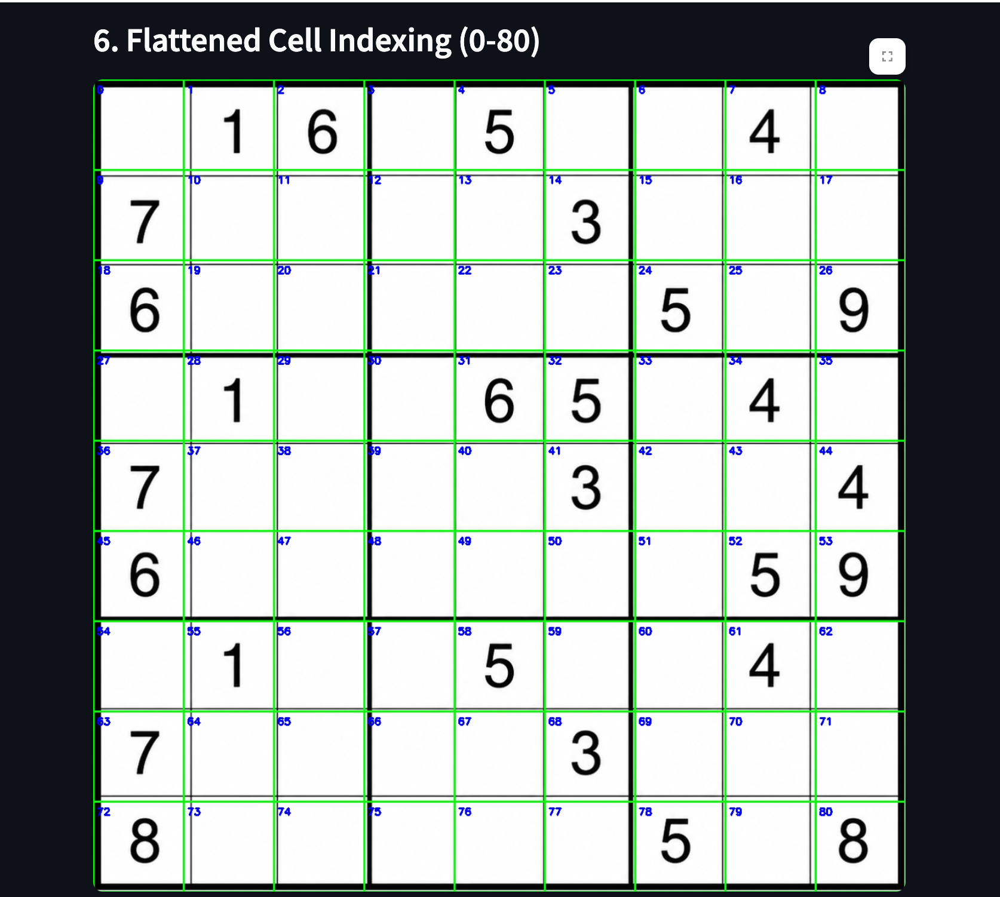

<div align="center">
  <h1>🧩 AI Sudoku Solver</h1>
  <p>
    <strong>An end-to-end, production-grade AI pipeline for solving Sudoku puzzles from images.</strong>
  </p>
  <p>
    
    
    
    
    
  </p>
</div>

</div>

---

## 🌟 Overview

The **AI Sudoku Solver** seamlessly bridges Computer Vision, Deep Learning, and classic algorithms to automatically read and solve Sudoku puzzles from standard images. 

Whether it's a newspaper clipping or a screenshot, simply upload the image to our intuitive **Streamlit** frontend. The **FastAPI** backend will process the image, extract the digits using a custom-trained Convolutional Neural Network, and instantly return the solved puzzle using a lightning-fast backtracking algorithm.

## ✨ Key Features

- **📸 Computer Vision Pipeline**: Employs **OpenCV** for robust image preprocessing, contour detection, and perspective transformation (homography) to perfectly isolate the Sudoku grid.
- **🧠 Deep Learning OCR**: Uses a custom **Keras/TensorFlow CNN** trained to recognize numerical digits from the extracted cells with high accuracy.
- **⚡ Fast Solving Algorithm**: Implements an optimized backtracking solver to instantly crack the extracted puzzle.
- **🌐 RESTful Backend**: A highly performant backend built with **FastAPI** that serves inference requests.
- **🎨 Interactive UI**: A sleek, user-friendly frontend built on **Streamlit** for effortless user interaction.
- **🐳 Docker Ready**: Containerized deployment support with Docker & Docker Compose for hassle-free setup.

---

## ⚙️ How It Works

1. **Grid Detection & Extraction**: The image is converted to grayscale, blurred, and thresholded. The largest contour is identified as the Sudoku board. A perspective warp is applied to flatten the grid.
2. **Cell Segmentation**: The unwarped grid is sliced into 81 distinct cells. Empty cells are filtered out.
3. **Digit Classification**: Each non-empty cell is fed into our pre-trained CNN model to predict the digit (1-9).
4. **Algorithmic Solving**: The parsed 9x9 matrix is passed to a backtracking algorithm which computes the final solution.
5. **Result Generation**: The completed puzzle is visually reconstructed and returned to the user.

### 📸 Pipeline Visualization

<!-- TODO: Update these filenames with your 8 screenshots in the 'assets/' folder -->
| Step 1 | Step 2 | Step 3 | Step 4 |
|:---:|:---:|:---:|:---:|
|  |  |  |  |

| Step 5 | Step 6 | Step 7 | Step 8 |
|:---:|:---:|:---:|:---:|
|  |  |  |  |

---

## 🏗️ Repository Structure

```text
.
├── ai/                     # 🧠 Core AI Pipeline (CV, OCR, Backtracking)
│   ├── utils/              # Helper functions & geometry math
│   ├── detector.py         # Main detection pipeline (Image -> Grid)
│   ├── digit_classifier.py # OCR Model loading and inference
│   ├── perspective.py      # Homography and unwarping scripts
│   ├── segmentation.py     # Grid slicing into 81 cells
│   └── solver.py           # Backtracking solver logic
├── assets/                 # 🖼️ Images and Screenshots for documentation
├── backend/                # ⚡ FastAPI application
│   └── main.py             # API endpoints
├── frontend/               # 🎨 Streamlit application
│   └── app.py              # Web UI
├── models/                 # 💾 Pre-trained Neural Networks
│   └── sudoku_digit_model.h5
├── scripts/                # 🛠️ Utility and Evaluation Scripts
│   └── evaluation/         # Testing and benchmarking scripts
├── tests/                  # 🧪 Comprehensive Pytest suite
├── training/               # 🏋️ ML Training & Fine-tuning scripts
│   └── train_model.py
├── Dockerfile              # 🐳 Docker configuration
├── docker-compose.yml      # 🐳 Docker Compose configuration
└── requirements.txt        # 📦 Python dependencies
```

---

## 🚀 Getting Started

### 1. Clone & Setup Virtual Environment
```bash
# Clone the repository
git clone <your-github-repo-url>
cd AI-Sudoku-Solver/SudokuAI

# Create and activate a virtual environment
python -m venv venv
source venv/bin/activate  # On Windows use: venv\Scripts\activate

# Install dependencies
pip install -r requirements.txt
```

### 2. Run the Applications Locally

**Start the FastAPI Backend**
```bash
uvicorn backend.main:app --reload
```
*The backend will be available at `http://localhost:8000`*

**Start the Streamlit Frontend** (in a new terminal)
```bash
source venv/bin/activate
streamlit run frontend/app.py
```
*The interactive UI will be available at `http://localhost:8501`*

---

## 🐳 Docker Deployment

To spin up the entire stack (Backend + Frontend) instantly using Docker:

```bash
docker-compose up --build
```

---

## 🧪 Testing & Training

**Run the Test Suite**
```bash
pytest tests/
```

**Train/Retrain the OCR Model**
```bash
python training/train_model.py
```

---

## 👨‍💻 Author Section

**Pratik S Kanoj**

**Artificial Intelligence & Data Science Engineer**

I am a passionate AI Engineer specializing in Machine Learning, Computer Vision, and full-stack integration. I build robust, production-ready AI systems that solve real-world problems. My expertise lies in taking complex Deep Learning architectures and deploying them into scalable, user-centric web applications.

**Technical Expertise:**

* **AI & Data Science:** Artificial Intelligence, Machine Learning, Deep Learning, Computer Vision, Generative AI, MLOps, Data Science.
* **Backend & Cloud:** Python, FastAPI, Docker, RESTful APIs.
* **Frontend:** React, JavaScript, HTML, CSS, Streamlit.

**Connect with me:**

* 💼 **LinkedIn:** [Pratik S Kanoj](https://www.linkedin.com/in/pratik-s-kanoj-a81432300/)
* 🐙 **GitHub:** [github.com/PRATIKSK7](https://github.com/PRATIKSK7)
* ✉️ **Email:** [pratiksk0077@gmail.com](mailto:pratiksk0077@gmail.com)

*If you found this project interesting or helpful, please consider giving it a ⭐ on GitHub!*

---

<div align="center">
  <i>Built with ❤️ using Python, OpenCV, and Deep Learning.</i>
</div>
